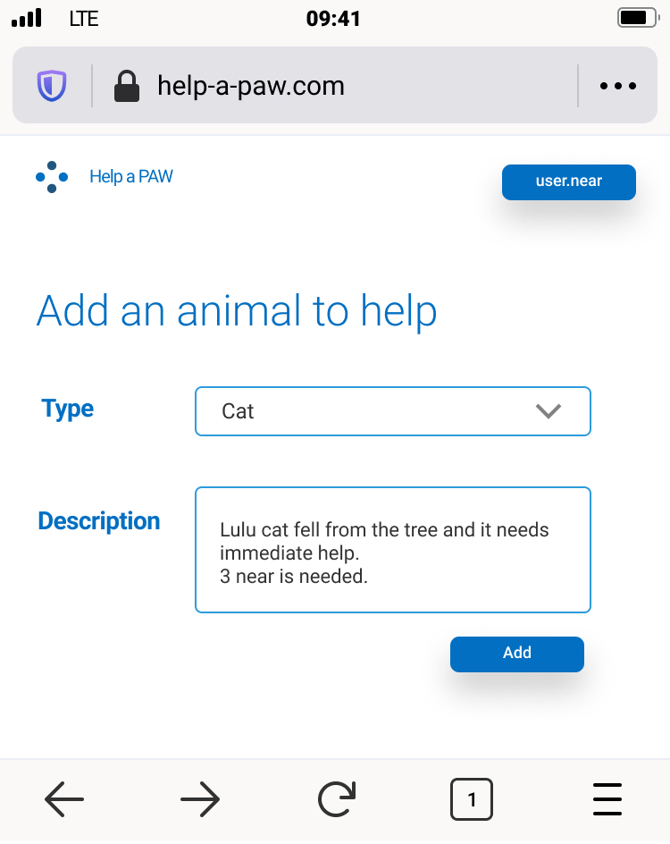

# Help a Paw
A family of smart contracts developed for NEAR Protocol to help sick and stray animals which are need of help.

## Consept
Shelters can give information about animals in need of help and how much funding each animal case require. Users can help these animals by donating an amount of money.

Contracts:
1- adding an animal info
2- sending donation to an animal

## Usage

### Getting started

1. clone this repo to a local folder
2. run `yarn`
3. run `yarn test`

### Running Scripts

To start the contract;
  - run `./script/1.init.sh`
To add an animal and donation;
  - run `./script/2.run.sh [type of animal] [amount of money]`

### Top-level `yarn` commands

- run `yarn test` to run all tests
  - (!) be sure to run `yarn build:release` at least once before:
    - run `yarn test:unit` to run only unit tests
- run `yarn build` to quickly verify build status
- run `yarn clean` to clean up build folder

### Other documentation

- Paw contract and test documentation
  - see `/src/paw/README` for Paw interface
  - see `/src/paw/__tests__/README` for Paw unit testing details

### UI Wireframes

 Here are some examples showing how we envision the basic user interface elements.

#### Add an animal

#### Animals list

#### Donate to an animal

# Near-protocol-help-paw
